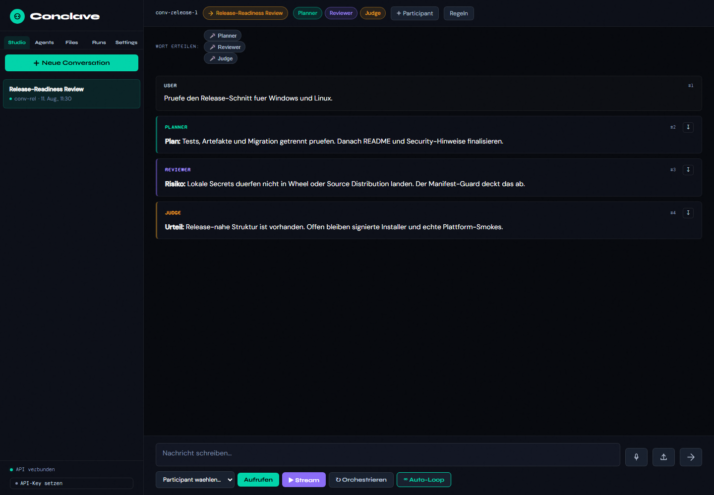

# Conclave Personal

Conclave Personal is a local multi-agent workspace for individual users. It
brings multiple AI models into one structured conversation, gives them explicit
roles, and makes their collaboration traceable through runs.

The user remains the control point. Agents are participants, not controllers.
Conversations, workspace files, agents, and usage data are stored locally by
default.

> Status: v0.1.5 Alpha. The primary path is local, desktop-first, and designed
> for individual users on Windows and Linux.



## What Conclave Is For

Conclave is not just another chat UI. Its core is:

- Multiple models.
- Explicit roles.
- Structured collaboration.
- Traceable runs.
- Human control.
- Local-first workspace.

In practice, this means:

- Run multi-agent conversations with Writer, Critic, Reviewer, Planner,
  Researcher, or Judge roles.
- Invite agents as participants into specific conversations.
- Use local workspace files explicitly as context.
- Let models work one by one, in parallel, or in auto-loops.
- Use Judge and review runs for mutual checking.
- Inspect runs, token usage, errors, and results.
- Work locally on Windows and Linux.

## 60-Second Example

```text
          -> Writer
Prompt ---+-> Critic -> Judge
          -> Researcher
```

1. Create a conversation.
2. Add agents as participants.
3. Assign roles: Writer drafts, Critic challenges, Judge evaluates.
4. Send a prompt.
5. Watch the run.
6. Compare the results and deliberately start the next round.

Minimal CLI flow:

```bash
conclave desktop
conclave agent-new writer --name "Writer" --provider "openai-responses" --preset "openai-responses" --model "<openai-model>" --role "Writer" --api-key "..."
conclave agent-new judge --name "Judge" --provider "ollama" --preset "ollama" --model "llama3.1" --role "Judge"
CONV=$(conclave --json new | python -c "import sys,json; print(json.load(sys.stdin)['conversation_id'])")
conclave add-participant "$CONV" writer --name "Writer" --type model
conclave add-participant "$CONV" judge --name "Judge" --type model
conclave message "$CONV" "Draft a concise product positioning and have it reviewed."
conclave invoke "$CONV" writer
conclave invoke "$CONV" judge
conclave runs "$CONV"
```

## Product Areas

| Area | Purpose |
| --- | --- |
| Studio | Conversations, messages, participants, floor control, invoke, stream, orchestration, auto-loop |
| Agents | Agents, roles, providers, models, presets, connection tests |
| Workspace | Local files, context, notes, outputs |
| Runs | Invoke, Judge, auto-loop, and orchestration history, usage, errors |
| Settings | API keys, data paths, theme, backup, local security mode |

## Non-Goals

- No GDPR or enterprise platform.
- No consent management per provider.
- No DPA or legal contract management.
- No role-based enterprise administration.
- No Docker requirement for end users.

## Platform Target

Conclave Personal supports Windows and Linux. The CI matrix checks Ubuntu and
Windows with Python 3.11 and 3.12.

The application core stays platform-neutral. Only startup, installation, and
autostart adapters are OS-specific:

- Windows: desktop launch, optional user autostart or NSSM service.
- Linux: desktop launch, optional `systemd --user` and `.desktop` file.
- Docker is not part of the v0.1.x end-user path.

## Installation

The published package is `conclave-personal`. The installed command remains
`conclave`.

### Windows

```powershell
pipx install conclave-personal
conclave desktop
```

### Linux

```bash
pipx install conclave-personal
conclave desktop
```

### From A Checkout

```bash
python -m pip install -e ".[dev-all]"
conclave desktop
```

Development tests:

```text
python -m pytest
```

Existing local SQLite data can be migrated explicitly:

```bash
conclave migrate-personal --from /path/to/old/conclave.db --dry-run
conclave migrate-personal --from /path/to/old/conclave.db
```

## Provider Setup

Create agents with a provider, model, and optional role:

```bash
conclave agent-new reviewer \
  --name "Reviewer" \
  --provider "anthropic" \
  --preset "anthropic" \
  --model "<anthropic-model>" \
  --role "Reviewer" \
  --api-key "..."
```

Ollama can run locally without an API key:

```bash
conclave agent-new local-judge \
  --name "Local Judge" \
  --provider "ollama" \
  --preset "ollama" \
  --model "llama3.1" \
  --role "Judge"
```

The [provider smoke test](docs/provider-smoke-test.md) describes a reproducible
end-to-end check with Claude, Gemini, and GPT.

## Local Quickstart

The recommended personal CLI path is:

```bash
conclave desktop
```

Technical modes:

```bash
conclave server
conclave web
```

Direct CLI flow:

```bash
conclave agent-new assistant \
  --name "Assistant" \
  --provider "openai-responses" \
  --preset "openai-responses" \
  --model "<openai-model>" \
  --api-key "..."

ID=$(conclave --json new | python -c "import sys,json; print(json.load(sys.stdin)['conversation_id'])")
conclave add-participant "$ID" assistant --name "Assistant" --type model
conclave message "$ID" "Analyze this idea from three perspectives."
conclave invoke "$ID" assistant
```

Auto-loop and Judge workflows are described in the
[example workflows](docs/beispiel-workflows.md).

## Core Concepts

### Conversation

A local workspace with a topic, messages, rules, and participants.

### Agent

A reusable provider, model, and role configuration.

### Participant

An agent inside a specific conversation.

### Workspace

A local folder for files, notes, context, and outputs. Files are not loaded as
context automatically. The user references them explicitly, for example with
`@workspace/notes.md`.

### Run

An executable work step: invoke, stream, orchestration, auto-loop, or Judge.
Runs expose status, errors, duration, and usage.

## Architecture State And Target

```text
src/conclave/
  domain/          pure domain models
  application/     services, orchestration, ports
  infrastructure/  providers, databases, crypto, runtime adapters
  api/             local HTTP API
  cli/             command line
  runtime/         platform-neutral desktop/server launch logic

src/conclave/assets/
  conclave-ui.html installed UI resource
  static/js/       current flat JS entry: api, state, utils, main
  static/js/features/
                   Studio, Agents, Workspace, Runs, Settings
  scripts/         Windows and Linux startup/service scripts

Future target for UI cleanup:

static/js/
  core/            API, State, Router, Events
  features/        Studio, Agents, Workspace, Runs, Settings
```

## Providers

Conclave is provider-agnostic. v0.1.x distinguishes between tested primary
paths and compatible presets.

### First-class / Tested

These paths are covered by local tests, API contracts, or adapter tests:

- OpenAI Responses
- OpenAI Chat Completions
- Anthropic
- Ollama

### Built-in Preset / Compatible / Experimental

These presets are built in, but behavior can vary by provider API, model, and
account:

- Gemini
- Mistral
- DeepSeek
- Qwen / DashScope
- Custom/OpenAI-compatible endpoints

API keys stay local and are stored encrypted in the local database for agents.
Ollama can work without an API key.

## Local-first, Not Offline-only

Conclave stores workspace files, configuration, agents, conversations, and run
history locally. When a remote provider such as OpenAI, Anthropic, Gemini,
Mistral, DeepSeek, or DashScope is used, the prompt and context data required
for that model call is sent to that provider. With Ollama or compatible local
endpoints, processing can happen fully locally.

## Security

Conclave binds the local API to `127.0.0.1` by default. In `production` mode,
a local API key is required. Workspace access stays inside the configured
workspace root, and hidden paths are not read as agent context.

More details: [Security for Conclave Personal](docs/sicherheit.md).

## Documentation

Important documents:

- [Multi-agent guide](docs/multi-agent-leitfaden.md)
- [Example workflows](docs/beispiel-workflows.md)
- [Security](docs/sicherheit.md)
- [Configuration](docs/referenz/konfiguration.md)
- [Release Notes v0.1.5](docs/release-notes-v0.1.5.md)
- [Release Notes v0.1.4](docs/release-notes-v0.1.4.md)
- [Release Notes v0.1.3](docs/release-notes-v0.1.3.md)
- [Release Notes v0.1.2](docs/release-notes-v0.1.2.md)
- [Release Notes v0.1.1](docs/release-notes-v0.1.1.md)
- [Release Notes v0.1.0](docs/release-notes-v0.1.0.md)
- [Documentation index](docs/index.md)

## Known Limitations

v0.1.5 remains alpha. Known limitations:

- Backup creation exists; restore currently validates only and does not write
  data back yet.
- Provider compatibility varies by API, model, account, and region.
- Remote providers receive the data required for the model call.
- Desktop mode starts the local web application in a browser.
- Advanced multi-agent orchestration is partly experimental.
- There is no native Windows installer, AppImage, or `.deb` package yet.

## Release Verification

The v0.1.5 surface was verified with these local checks:

- `python -m pytest`
- `python -m build --sdist --wheel`
- Installation from the built wheel in a fresh environment.
- `conclave --help`
- `conclave desktop`
- Artifact inspection without workspace data, databases, keys, logs, and old
  enterprise/GDPR paths.

## Origin

This project was created exclusively by LLM models.

## License

PolyForm Noncommercial License 1.0.0. See [LICENSE](LICENSE).

Free for noncommercial use. Commercial use requires a separate license.
Commercial licensing: coming soon.
