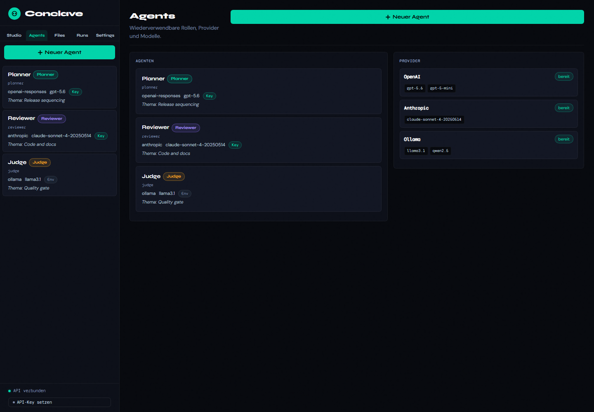

# Personal UI Architektur

## Ziel

Die Conclave-UI wird für ein persönliches Multi-Agent-Arbeitswerkzeug neu
geschnitten. Der bisherige Ansatz mit vielen Funktionen in einem Bedienraum
wird durch fünf fachliche Arbeitsräume ersetzt.

Die UI ist keine Enterprise-Konsole. Sie ist ein lokales Arbeitsstudio für
einzelne Nutzer.

## Globale Navigation

- Studio
- Agents
- Workspace
- Runs
- Settings

Globale Navigation trennt Arbeitsräume. Lokale Navigation strukturiert nur
innerhalb eines Arbeitsraums.

## Sprache

Die Desktop-UI ist mindestens auf Deutsch und Englisch umschaltbar. Die
Sprachauswahl liegt im Sidebar-Footer und wird lokal im Browser unter
`conclave_ui_lang` gespeichert.

Die Umschaltung betrifft die sichtbaren Kernflächen der App:

- globale Navigation
- Sidebar-Panels
- Modale Dialoge
- zentrale Buttons, Placeholder und Hilfetexte
- wichtige dynamische Statusmeldungen und Toasts
- generierte Default-Systemprompts für neue Agentenrollen

API-Fehlermeldungen aus dem Backend können weiterhin im Originaltext des
Servers erscheinen.

## 1. Studio

### Zweck

Studio ist der primäre Arbeitsraum für aktive Conversations.

### Inhalte

- Conversation-Liste
- aktive Session
- Chat-Verlauf
- Participants
- Floor Control
- Invoke und Stream
- Orchestrierung
- Auto-Loop
- Conversation-Regeln

### Nicht im Studio

- Agent-Konfiguration im Detail
- globale Provider-Verwaltung
- Workspace-Dateiverwaltung
- Usage-Historie
- Backup- oder App-Einstellungen

## 2. Agents



### Zweck

Agents ist der Verwaltungsraum für wiederverwendbare KI-Teilnehmer.

### Inhalte

- Agentenliste
- Agent anlegen, bearbeiten, löschen
- Rolle/System-Prompt
- Provider
- Modell
- API-Key-Status
- Verbindungstest
- Presets

### Rollen

Startrollen:

- Writer
- Reviewer
- Critic
- Researcher
- Planner
- Custom

## 3. Workspace

### Zweck

Workspace ist der lokale Datenraum für Kontext, Notizen und Outputs.

### Inhalte

- Dateiübersicht
- Textdateien lesen
- Datei hochladen oder Text ablegen
- `@workspace/...` Referenzen kopieren/einfügen
- Output-Ordner anzeigen
- Sichtbarkeit für Agenten erklären

### Sicherheitsregeln

- Agenten dürfen nicht aus dem Workspace ausbrechen.
- Versteckte Ordner sind für Agenten unsichtbar.
- Große Dateien brauchen Limits oder explizite Bestätigung.
- Kontext wird nicht automatisch vollständig geladen.

## 4. Runs

### Zweck

Runs macht Arbeitsschritte sichtbar, die über einzelne Chat-Messages
hinausgehen.

### Inhalte

- Invoke-Historie
- Orchestrierungsläufe
- Auto-Loops
- Status
- Dauer
- beteiligte Agenten
- Fehler
- Token-Usage

### Ziel

Der Nutzer soll sehen können, was gelaufen ist, was es gekostet hat und wo
ein Lauf fehlgeschlagen ist.

## 5. Settings

### Zweck

Settings bündelt lokale App-Konfiguration.

### Inhalte

- API-Keys
- lokaler Datenpfad
- Workspace-Pfad
- Theme
- Backup und Restore
- lokaler Sicherheitsmodus
- Server-Port
- Desktop-/Browser-Startmodus

## Technischer Stand und Zielstruktur

Aktuell liegen die installierten UI-Ressourcen als Package-Data unter
`src/conclave/assets/`. Der JavaScript-Einstieg ist noch flach:

```text
src/conclave/assets/static/js/
  api.js
  i18n.js
  state.js
  utils.js
  main.js
  features/
    agents.js
    auth.js
    autoloop.js
    conversations.js
    export.js
    floor.js
    messages.js
    participants.js
    runs.js
    settings.js
    speech.js
    usage.js
    workspace.js
```

Zielstruktur für spätere UI-Aufräumarbeiten:

```text
src/conclave/assets/static/js/
  core/
    api.js
    state.js
    router.js
    events.js
    render.js
  features/
    studio/
      conversations.js
      session.js
      participants.js
      floor.js
      orchestration.js
      autoloop.js
    agents/
      agents.js
      providers.js
      presets.js
    workspace/
      files.js
      editor.js
      references.js
    runs/
      runs.js
      usage.js
    settings/
      settings.js
      keys.js
      backup.js
```

## Migrationsreihenfolge

1. Globale Navigation auf die fünf Personal-Bereiche umstellen.
2. Privacy-/DSGVO-Panel entfernen.
3. Agentenverwaltung aus dem Studio herauslösen.
4. Workspace als eigenen Bereich bauen.
5. Usage, Invoke-, Orchestrierungs- und Auto-Loop-Historie in Runs sammeln.
6. API-Key-Status, Datenpfade und Backup nach Settings verschieben.
7. Inline-Handler und globale UI-Zustände schrittweise reduzieren.

## UX-Regeln

- Erste Ansicht ist Studio.
- Eine primäre Aufgabe pro Screen.
- Keine DSGVO-Begriffe in der Personal-UI.
- Agenten sind schnell testbar.
- Workspace-Referenzen sind sichtbar und kopierbar.
- Runs zeigen Zustand, Dauer, Agenten und Kosten.
- Fehler werden als handlungsnahe Meldungen dargestellt.
